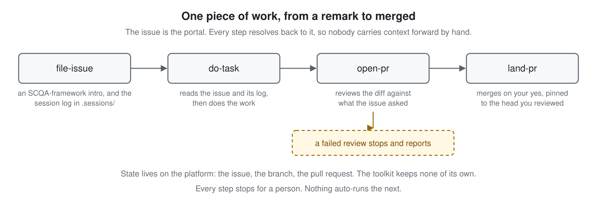

# agent-workflows

You work with an agent in a Claude Code session, and a remark there — *the parser drops
trailing commas* — becomes work that should end merged. Left to its own ideas, the agent
rewrites the request in its own words, grades its own work done and reads *"merge it"* as
approval, while the reasoning stays in a session nobody reads again. One piece of work has to
get from a remark to merged without drifting from what was asked. This plugin carries it with
four skills — `file-issue`, `do-task`, `open-pr` and `land-pr`, each stopping for a person —
and eight more that report on it, gate what it produces and clean up after it, each a short
list of steps a person can review.

## Requirements

- [Claude Code](https://code.claude.com/docs) with plugin support
- `gh` or `glab`, installed and authenticated. Every step that touches an issue or a pull
  request goes through one of them

## Install

    /plugin marketplace add dogkeeper886/agent-workflows
    /plugin install agent-workflows@agent-workflows

## Using it

Ask for what you want in your own words, or invoke a skill by name:

    /agent-workflows:file-issue the parser drops trailing commas
    /agent-workflows:do-task 42

The namespaced form always reaches the installed skill. A bare `/file-issue` reaches a local
copy of that name when your project has one.

## How it works

The issue is the portal. `file-issue` opens it with an intro that follows the SCQA framework
(situation, complication, question, answer) and links the session log it came from, so the
agent that picks it up reads the reasoning, not only the request.
`do-task` and `open-pr` read the issue and that log before anything else, and `land-pr`
closes the issue when the merge did not.

**`open-pr` is the gate.** The agent that wrote the work does not grade it done: `open-pr`
reviews the diff against what the issue asked, and a failed review stops and reports
instead of opening the pull request. `land-pr` then asks whether you reviewed and tested
the pull request at its head, and merges only that commit.

**The toolkit keeps no state of its own.** No story file, no plan file, no index. The
issue, the branch and the pull request live on the platform, which is the one place both a
person and an agent can read.

## The skills

### The spine

| Skill | What it does |
|---|---|
| [file-issue](plugins/agent-workflows/skills/file-issue/SKILL.md) | Files an issue with an intro that follows the SCQA framework and links the session log behind it, asking first when the log holds a secret |
| [do-task](plugins/agent-workflows/skills/do-task/SKILL.md) | Reads the issue, its comments and its session log whole, then does the work |
| [open-pr](plugins/agent-workflows/skills/open-pr/SKILL.md) | Reviews the diff against what the issue asked, and opens the pull request only when the review passes |
| [land-pr](plugins/agent-workflows/skills/land-pr/SKILL.md) | Merges pinned to the head a person says they reviewed and tested, closes the issue and deletes the branch |

### Around it

| Skill | What it does |
|---|---|
| [gen-readme](plugins/agent-workflows/skills/gen-readme/SKILL.md) | Writes a README from the code, with one rendered diagram per key point |
| [review-readme](plugins/agent-workflows/skills/review-readme/SKILL.md) | Gates a README on three counts: useful to a newcomer, true to the code, and readable |
| [skill-structure](plugins/agent-workflows/skills/skill-structure/SKILL.md) | Writes a skill as one description paragraph, a header and a list of steps |
| [reviewing-phrasing](plugins/agent-workflows/skills/reviewing-phrasing/SKILL.md) | Reviews the words of a human-read document, greping the mechanical tells first |
| [reviewing-typography](plugins/agent-workflows/skills/reviewing-typography/SKILL.md) | Reviews how such a document looks, the way a UI designer would |
| [reporting-outcomes](plugins/agent-workflows/skills/reporting-outcomes/SKILL.md) | Opens every report with the verdict and ends it with one next step |
| [remove-stale-files](plugins/agent-workflows/skills/remove-stale-files/SKILL.md) | Deletes what earlier versions of this plugin left behind, and the forks that shadow it |
| [article-structure-study](plugins/agent-workflows/skills/article-structure-study/SKILL.md) | Studies an article's structure by fixed steps: a Markdown file with the title and a list of sections, each clause's main character bolded and its action in a code span |

## This repo is its own marketplace

The skills are developed in the same tree that serves them, so they are used the way they
ship. If you are working on the plugin, add this directory as the marketplace source and
restart the session to load an edit — including one you have not committed yet.

## Session logs

`.sessions/` holds the raw agent transcripts, copied out of `~/.claude/projects/` and
linked from the issues they led to. A secret or private detail is masked only after the
user is asked, and nothing else is changed. A log informs; it never binds. The code binds on what is
true now, the issue binds on what a change may touch, and a log that seems to forbid
something is only a previous session's situation.

## Contributing

`skill-structure` shapes a skill, `reviewing-phrasing` and `reviewing-typography` gate a
document. By convention both are run on this repo's own files before they land; nothing
enforces it. Diagrams are SVG sources committed alongside PNGs rendered by an explicit
command, `rsvg-convert` by default:

    rsvg-convert -z 2 docs/diagrams/<name>.svg -o docs/diagrams/png/<name>.png

Renaming a skill leaves citations behind in the other eleven, in both manifests and in
this file. Check them before opening a pull request:

    scripts/check-names.sh

## License

MIT, as declared in
[plugin.json](plugins/agent-workflows/.claude-plugin/plugin.json).
